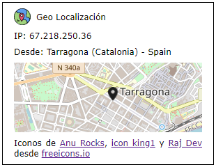

# Gtx Geo Localización

Gtx Geo Localización es un web component creado usando la librería [Stencil](https://stenciljs.com/).

Obtiene información geográfica de la conexión del visitante donde se use el web component y la muestra en un mapa.

Para obtener la información usa la API [GeoJS](https://www.geojs.io/) y para el mapa usa [OpenLayers](https://openlayers.org/)



# Iniciar el web component en el servidor local

Stencil dispone de un servidor local para el desarrollo que actualiza la página donde se muestra el web component según se va desarrollando.

Se ha de clonar el proyecto, acceder a la carpeta del proyecto, instalar las depedencias y ejecutar el script de inicio.

````
git clone https://github.com/theguitxo/gtx-geo-location

cd gtx-geo-location

npm install

npm start
````
